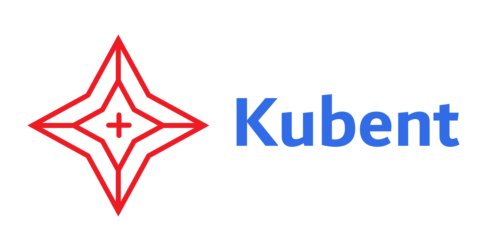

__*Easily check your clusters for use of deprecated APIs*__

Kubernetes 1.16 is slowly starting to roll out, not only across various managed
Kubernetes offerings, and with that come a lot of API deprecations[1][1].

*Kube No Trouble (__`kubent`__)* is a simple tool to check whether you're using
any of these API versions in your cluster and therefore should upgrade your
workloads first, before upgrading your Kubernetes cluster.

This tool will be able to detect deprecated APIs depending on how you deploy
your resources, as we need the original manifest to be stored somewhere. In
particular following tools are supported:
- **file**    - local manifests in YAML or JSON
- **kubectl** - uses the `kubectl.kubernetes.io/last-applied-configuration` annotation
- **Helm v3** - uses Helm manifests stored as Secrets or ConfigMaps directly in individual namespaces

[1]: https://kubernetes.io/blog/2019/07/18/api-deprecations-in-1-16/

**Additional resources:**
- Blog post on K8s deprecated APIs and introduction of kubent: [Kubernetes: Deprecated APIs aka Introducing Kube-No-Trouble][2]

[2]: https://stepan.wtf/kubernetes-deprecated-apis-introducing-kubent/

## Install

Run the following command in your terminal to install `kubent` using a shell script:

```sh
sh -c "$(curl -sSL https://git.io/install-kubent)"
```

*(The script will download latest version and unpack to `/usr/local/bin`).*

### Manual Installation

You can download the
[latest release](https://github.com/LeMyst/kube-no-trouble/releases/latest)
for your platform and unpack manually.

### Third-Party Installation

Please note that third-party installation methods are maintained by the community.
The packages may not always be up-to-date with the latest releases of `kubent`.

#### Homebrew

`kubent` is available as a [formula](https://formulae.brew.sh/formula/kubent)
on [Homebrew](https://brew.sh/). If you're using macOS or Linux, you can run
the following command to install `kubent`:

```sh
brew install kubent
```

#### Scoop
`kubent` is available for [Scoop](https://scoop.sh/) as an [app](https://bjansen.github.io/scoop-apps/main/kubent/).
Install `kubent` by running:

```powershell
scoop install kubent
```

## Usage

Configure Kubectl's current context to point to your cluster, `kubent` will
look for the kube `.config` file in standard locations (you can point it to custom
location using the `-k` switch).

**`kubent`** will collect resources from your cluster and report on found issues.

*Please note that you need to have sufficient permissions to read Secrets in the
cluster in order to use `Helm*` collectors.*

```sh
$./kubent
6:25PM INF >>> Kube No Trouble `kubent` <<<
6:25PM INF Initializing collectors and retrieving data
6:25PM INF Retrieved 103 resources from collector name=Cluster
6:25PM INF Retrieved 0 resources from collector name="Helm v3"
6:25PM INF Loaded ruleset name=deprecated-1-16.rego
6:25PM INF Loaded ruleset name=deprecated-1-20.rego
__________________________________________________________________________________________
>>> 1.16 Deprecated APIs <<<
------------------------------------------------------------------------------------------
KIND         NAMESPACE     NAME                    API_VERSION
Deployment   default       nginx-deployment-old    apps/v1beta1
Deployment   kube-system   event-exporter-v0.2.5   apps/v1beta1
Deployment   kube-system   k8s-snapshots           extensions/v1beta1
Deployment   kube-system   kube-dns                extensions/v1beta1
__________________________________________________________________________________________
>>> 1.20 Deprecated APIs <<<
------------------------------------------------------------------------------------------
KIND      NAMESPACE   NAME           API_VERSION
Ingress   default     test-ingress   extensions/v1beta1
```

### Arguments

You can list all the configuration options available using `--help` switch:
```sh
$./kubent -h
Usage of ./kubent:
  -A, --additional-annotation strings   additional annotations that should be checked to determine the last applied config
  -a, --additional-kind strings         additional kinds of resources to report in Kind.version.group.com format
  -c, --cluster                         enable Cluster collector (default true)
  -x, --context string                  kubeconfig context
  -e, --exit-error                      exit with non-zero code when issues are found
  -f, --filename strings                manifests to check, use - for stdin
      --helm3                           enable Helm v3 collector (default true)
  -k, --kubeconfig string               path to the kubeconfig file
  -l, --log-level string                set log level (trace, debug, info, warn, error, fatal, panic, disabled) (default "info")
  -o, --output string                   output format - [text|json|csv] (default "text")
  -O, --output-file string        output file, use - for stdout (default "-")
  -t, --target-version string           target K8s version in SemVer format (autodetected by default)
  -v, --version                         prints the version of kubent and exits
```
- *`--additional-annotation`*
  Check additional annotations for the last applied configuration. This can be useful if a resource was applied
  with a tool other than kubectl. The flag can be used multiple times.

- *`-a, --additional-kind`*
  Tells `kubent` to flag additional custom resources when found in the specified version. The flag can be used multiple
  times. The expected format is full *Kind.version.group.com* form - e.g. `-a ManagedCertificate.v1.networking.gke.io`.

- *`-x, --context`*
  Select context from kubeconfig file (`current-context` from the file is used by default).

- *`k, --kubeconfig`*
  Path to kubeconfig file to use. This takes precedence over `KUBECONFIG` environment variable, which is also supported
  and can contain multiple paths, and default `~.kube/config`.

- *`-t, --target-version`*
  `Kubent` will try to detect K8S cluster version and display only relevant findings. This flag allows to override this
  version for scenarios like use in CI with the file collector only, when detection from an actual cluster is not possible.
  Expected format is `major.minor[.patch]`, e.g. `1.16` or `1.16.3`.

### Docker Image

We also publish official container image, which can be found at:
`ghcr.io/LeMyst/kube-no-trouble:latest` (also available tagged with each
individual release version).

To run locally, you'll need to provide credentials, e.g. by sharing your
kubectl config:

```sh
$ docker run -it --rm \
    -v "${HOME}/.kube/config:/.kubeconfig" \
    ghcr.io/LeMyst/kube-no-trouble:latest \
    -k /.kubeconfig
```

You can use `kubectl run` to run inside a K8S cluster, as a one-off. In that
case the credentials will be picked up via the pod's service account from the
environment, but you'll want to grant relevant permissions first (see
[docs/k8s-sa-and-role-example.yaml](docs/k8s-sa-and-role-example.yaml)):

```sh
$ kubectl run kubent --restart=Never --rm -i --tty \
    --image ghcr.io/LeMyst/kube-no-trouble:latest \
    --overrides='{"spec": {"serviceAccount": "kubent"}}'
```

### Use in CI

#### Exit codes

`kubent` will by default return `0` exit code if the program succeeds, even if
it finds deprecated resources, and non-zero exit code if there is an error
during runtime. Because all info output goes to stderr, it's easy to check in
shell if any issues were found:

```shell
test -z "$(kubent)"                 # if stdout output is empty, means no issues were found
                                    # equivalent to [ -z "$(kubent)" ]
```

It's actually better so split this into two steps, in order to differentiate
between runtime error and found issues:

```shell
if ! OUTPUT="$(kubent)"; then       # check for non-zero return code first
  echo "kubent failed to run!"
elif [ -n "${OUTPUT}" ]; then       # check for empty stdout
  echo "Deprecated resources found"
fi
```

You can also use `--exit-error` (`-e`) flag, which will make kubent to exit
with non-zero return code (`200`) in case any issues are found.

Alternatively, use the json output and smth. like `jq` to check if the result is
empty:

```
kubent -o json | jq -e 'length == 0'
```

#### Scanning all files in directory

If you want to scan all files in a given directory, you can use the following
shell snippet:

```shell
FILES=($(ls *.yaml)); kubent ${FILES[@]/#/-f} --helm3=false -c=false
```

## Development

The simplest way to build `kubent` is:

```sh
# Clone the repository
git clone https://github.com/LeMyst/kube-no-trouble.git
cd kube-no-trouble/
# Build
go build -o bin/kubent cmd/kubent/main.go
```

Otherwise there's `Makefile`
```sh
$ make
make
all                            Clean, build and pack
help                           Prints list of tasks
build                          Build binary
generate                       Go generate
release-artifacts              Create release artifacts
clean                          Clean build artifacts
```

### Commit messages

We enforce simple version of [Conventional Commits][cc] in the form:

```
<type>: <summary>

[optional body]

[optional footer(s)]
```

Where type is one of:
- **build** - Affects build and/or build system
- **chore** - Other non-functional changes
- **ci** - Affects CI (e.g. GitHub actions)
- **dep** - Dependency update
- **docs** - Documentation only change
- **feat** - A new feature
- **fix** - A bug fix
- **ref** - Code refactoring without functionality change
- **style** - Formatting changes
- **test** - Adding/changing tests

[cc]: https://www.conventionalcommits.org/

Use imperative, present tense (Add, not ~Added~), capitalize first letter of
summary, no dot at the and. The body and footer are optional. Relevant GitHub
issues should be referenced in the footer in the form `Fixes #123, fixes #456`.

### Changelog

Changelog is generated automatically based on merged PRs using
[changelog-gen][chlg-gen]. Template can be found in `scripts/changelog.tmpl`.

PRs are categorized based on their labels, into following sections:
- Announcements - `announcement` label
- Breaking Changes - `breaking-change` label
- Features - `feature` label
- Changes - `change` label
- Fixes - `fix` label
- Internal/Other - everything else

PR can be excluded from changelog with `no-release-note` label. PR title is
used by default, however, the copy can be customized by including following
block in the PR body:

~~~
```release-note
This is an example release note!
```
~~~

[chlg-gen]: https://github.com/paultyng/changelog-gen

## Issues and Contributions

Please open any issues and/or PRs against github.com/LeMyst/kube-no-trouble repository.

Please ensure any contributions are signed with a valid gpg key. We use this to validate that you have committed this and no one else. You can learn how to create a GPG key [here](https://docs.github.com/en/authentication/managing-commit-signature-verification/generating-a-new-gpg-key).

Feedback and contributions are always welcome!
